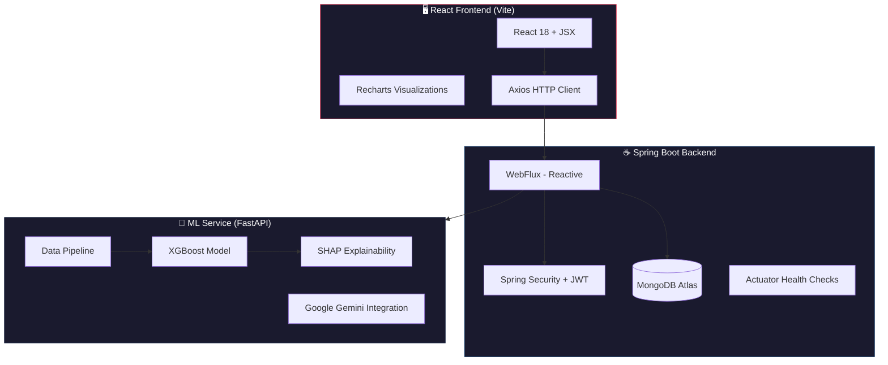
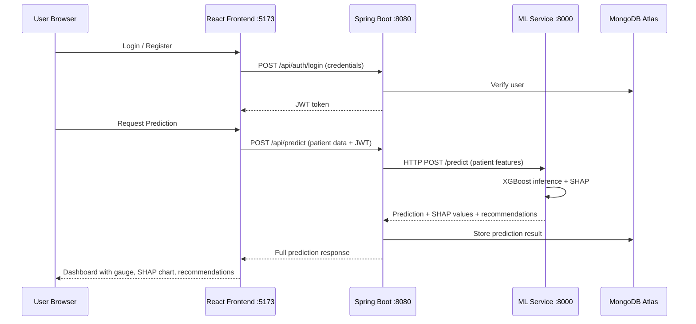

# 📊 Directory Analysis — Frailty Risk Prediction System

> [!NOTE]
> **Project**: Explainable, real-time **Frailty Risk Prediction System** using Social Determinants of Health (SDOH) data.

---

## Architecture Overview



---

## 📁 Project Structure

```
d:\New folder (3)\
├── .git/                        # Git repository
├── .gitignore                   # Ignore rules
├── .vscode/                     # VS Code settings
├── .zenflow/                    # ZenFlow task tracking
│   └── tasks/
├── docker/                      # Container orchestration
│   ├── .env                     # Environment secrets
│   └── docker-compose.yml       # 3-service compose
│
├── ml-service/                  # 🧠 Python ML microservice
│   ├── api/                     # FastAPI application
│   │   ├── main.py              # App entry + middleware
│   │   ├── schemas.py           # Pydantic models
│   │   └── routers/
│   │       └── predict.py       # /predict endpoint
│   ├── src/                     # Core ML logic
│   │   ├── pipeline.py          # Orchestration pipeline
│   │   ├── model/
│   │   │   ├── train.py         # XGBoost training
│   │   │   ├── predict.py       # Inference logic
│   │   │   └── evaluate.py      # Model evaluation
│   │   ├── explainability/
│   │   │   └── shap_explainer.py # SHAP explanations
│   │   ├── features/            # Feature engineering
│   │   ├── preprocessing/       # Data preprocessing
│   │   └── recommendations/     # Clinical recommendations
│   ├── data/                    # Data assets
│   │   ├── raw/                 # Raw datasets
│   │   ├── MergeData.py         # SDOH + health data merge
│   │   ├── CalcFrailty.py       # Frailty score calculation
│   │   ├── merged_clean.csv     # Cleaned merged data
│   │   └── patient_frailty_final.csv # Final labeled dataset
│   ├── artifacts/               # Trained model artifacts
│   ├── venv/                    # Python virtual environment
│   ├── requirements.txt         # Python dependencies
│   ├── Dockerfile               # Container build
│   └── start.bat / start_ml.bat # Windows start scripts
│
├── springboot-backend/          # ☕ Java backend service
│   ├── pom.xml                  # Maven config (Spring Boot 3.3.1)
│   ├── Dockerfile               # Container build
│   ├── src/main/java/com/frailty/
│   │   ├── FrailtyApplication.java  # App entry point
│   │   ├── config/              # App configuration
│   │   ├── controller/          # REST controllers
│   │   ├── dto/                 # Data transfer objects
│   │   ├── model/               # Domain entities
│   │   ├── repository/          # MongoDB repositories
│   │   ├── security/            # JWT auth + filters
│   │   └── service/             # Business logic
│   └── src/main/resources/      # App properties
│
└── react-frontend/              # 🖥️ React UI
    ├── package.json             # Node dependencies
    ├── vite.config.js           # Vite bundler config
    ├── index.html               # HTML entry
    ├── Dockerfile               # Container build
    └── src/
        ├── App.jsx              # Root component + routing
        ├── main.jsx             # React DOM entry
        ├── index.css            # Global styles
        ├── context/             # React context (auth state)
        ├── services/            # API service layer
        ├── pages/               # Page components
        │   ├── Login.jsx        # Login page
        │   ├── Register.jsx     # Registration page
        │   ├── Dashboard.jsx    # Main dashboard
        │   ├── Patients.jsx     # Patient management (12KB)
        │   ├── PatientDashboard.jsx # Individual patient view
        │   ├── NewPrediction.jsx    # Run new prediction
        │   ├── History.jsx      # Prediction history
        │   └── AdminPanel.jsx   # Admin panel
        └── components/          # Reusable UI components
            ├── ProtectedRoute.jsx
            ├── FrailtyGauge/    # Risk gauge visualization
            ├── ShapChart/       # SHAP explanation chart
            ├── HistoryTable/    # Prediction history table
            ├── PatientForm/     # Patient data form
            ├── RecommendationsPanel/ # Clinical recommendations
            └── Sidebar/         # Navigation sidebar
```

---

## 🔧 Technology Stack

| Layer | Technology | Key Details |
|-------|-----------|-------------|
| **Frontend** | React 18 + Vite 5 | JSX, React Router v6, Recharts, Axios |
| **Backend** | Spring Boot 3.3.1 | **Reactive** (WebFlux), Java 21, Lombok |
| **Database** | MongoDB Atlas | Reactive driver (`spring-boot-starter-data-mongodb-reactive`) |
| **Auth** | JWT (jjwt 0.12.5) | Spring Security + custom JWT filters |
| **ML Engine** | XGBoost + SHAP | FastAPI serving, Pydantic schemas |
| **AI Integration** | Google Gemini | `google-genai` SDK for clinical recommendations |
| **Data Science** | pandas, numpy, scikit-learn, matplotlib, seaborn | Data pipeline and evaluation |
| **Deployment** | Docker Compose | 3 services with health checks and dependency ordering |

---

## 🔌 Service Communication



---

## 📦 Key Observations

### ✅ Strengths
- **Clean microservice architecture** — 3 well-separated services with Docker Compose orchestration
- **Reactive backend** — WebFlux for non-blocking I/O between services
- **Explainable AI** — SHAP integration provides model transparency, critical for healthcare
- **Full auth system** — JWT-based authentication with Spring Security
- **Rich frontend** — Dedicated visualization components (FrailtyGauge, ShapChart, RecommendationsPanel)
- **Health checks** — Docker Compose health checks with proper `depends_on` ordering
- **Data pipeline** — Raw data → merge → frailty calculation → model training is reproducible

### ⚠️ Notes
- **No Kafka** — Communication between backend and ML service is via direct HTTP (previously refactored from Kafka based on conversation history)
- **MongoDB Atlas** — Cloud-hosted database (connection string visible in docker-compose)
- **Google Gemini** — Used in the recommendations module (likely for generating clinical text)
- **`Patients.jsx` is the largest frontend file** (12.5KB) — may benefit from splitting
- **`venv/` is tracked in the directory** — present locally but correctly gitignored

---

## 📊 File Size Summary

| Service | Files | Notable Large Files |
|---------|-------|-------------------|
| ML Service | ~20+ source files | `patient_frailty_final.csv` (230KB), `merged_clean.csv` (222KB) |
| Backend | ~15+ Java files | `backend.log` (10KB), `pom.xml` (3.3KB) |
| Frontend | ~20+ JSX/CSS files | `package-lock.json` (192KB), `Patients.jsx` (12.5KB), `index.css` (10.6KB) |
